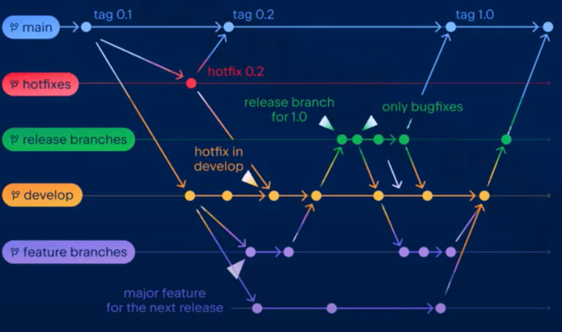
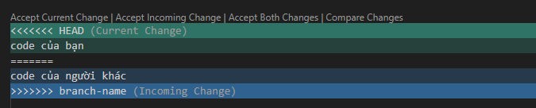

Required:  
- Introduction to Git and version control  
- Gitflow branching model (feature, develop, release, hotfix)  
- Common Git commands (merge, rebase, stash, log, ...)  
- Collaboration using pull requests, resolving conflicts  
---
# Những câu lệnh Git thông dụng
**Cấu hình tên user,email (toàn cục). Thông tin sẽ hiển thị trong commit history.**
```bash
git config --global user.name "Ho Van Nghia"
git config --global user.email "nghia.ho@sotatek.com"
```

**Pull toàn bộ repository từ server về máy local.**
```bash
git clone http://git.nghiahv.tech/shoeshop/shoeshop.git
---
Username:
Password:
```

Thêm tất cả file mới hoặc thay đổi vào staging area (khu vực chuẩn bị commit).
```bash
git add .
```
Note: Có thể thay `.` bằng tên file cụ thể, ví dụ `git add index.js`.

Tạo một commit (một điểm lưu thay đổi trong lịch sử Git).
```
git commit -m "feat(project): create base project"
```

Đẩy (push) commit từ local lên remote repo (origin), nhánh (main).
```bash
git push origin main
```

Lấy (fetch) và đồng bộ (merge) code mới nhất từ remote repository về local.
```
git pull 
```
Note: 
`git pull` = `git fetch` + `git merge`
- `git fetch`: tải thay đổi từ remote về, nhưng chưa áp dụng vào code local.
- `git merge`: gộp những thay đổi vừa fetch vào nhánh hiện tại của bạn.


**Git command**  
Làm việc với nhánh
```bash
git branch	                      # Liệt kê các nhánh local
git checkout -b feature/login     # Tạo và chuyển sang nhánh mới
git switch feature/login          # Chuyển nhánh
git branch -d feature/login       # Xoá nhánh
```

Merge & Rebase
```bash
git merge feature/login           # Merge nhánh vào nhánh hiện tại
git rebase develop                # Rebase nhánh hiện tại lên develop
```

Stash (lưu tạm thay đổi)
```bash
git stash                         # Lưu thay đổi tạm thời
git stash pop                     # Khôi phục lại thay đổi
```

Kiểm tra lịch sử
```bash
git log --oneline --graph --all   # Hiển thị lịch sử commit ngắn gọn
git diff                          # Xem sự khác biệt
```

Pull, Push, Fetch
```bash
git pull origin develop           # Lấy code mới về và merge
git push origin feature/login     # Đẩy nhánh lên remote
git fetch                         # Lấy dữ liệu remote mà chưa merge
```


Git command | Cong dung
--- | ---
git init | Khởi tạo repo Git mới trong thư mục hiện tại
git status | Xem trạng thái file (modified, staged, untracked)


---
# Git workflow   
Git workflow là một quy trình làm việc hoặc phương pháp tổ chức việc sử dụng Git trong quản lý mã nguồn  


Một workflow thường quy định:
- Các nhánh: main, develop, feature, hotfix, release,…
- Quy trình tách và hợp nhất nhánh: Ví dụ như nhánh feature phải được tách ra từ develop, hay mã nguồn từ develop mới được phép hợp nhất vào main
- Quy tắc cộng tác: Đưa ra quy định về việc tạo Pull request, review code trước khi hợp nhất,…

Y nghia cac nhanh tren git workflow
- `main` (hoặc `master`)
  - Chứa mã nguồn ổn định nhất, sẵn sàng để release.
- `develop`
  - Nơi tích hợp các tính năng mới, sau đó mới merge vào main.
- Feature branch (`feature/*`)
  - Tạo từ `develop`.
  - Mỗi tính năng (feature) hoặc task có một nhánh riêng.
  - Khi hoàn thành → merge vào `develop`.
- Release branch (`release/*`)
  - Tạo từ `develop` khi chuẩn bị phát hành.
  - Chỉ fix bug nhỏ, không thêm tính năng mới.
  - Merge vào `main` (xuất bản) và `develop` (đồng bộ).
- Hotfix branch (`hotfix/*`)
  - Tạo từ `main` khi cần sửa lỗi khẩn cấp trên production.
  - Sau khi sửa → merge vào cả `main` và `develop`

**Workflow:**
- feature/* → develop → release/* → main
  (và hotfix/* có thể đi thẳng từ main).

# Các Thành Phần Chính Của Git Workflow

**1. Quy Tắc Commit**  
Nguyên tắc cơ bản:
- Viết commit message ngắn gọn, rõ ràng
- Tuân theo format thống nhất trong team
- Mỗi commit chỉ giải quyết một vấn đề cụ thể
```bash
# Format chuẩn
<type>[optional scope]: <description>

# Ví dụ thực tế
feat: thêm tính năng đăng nhập bằng Google
fix: khắc phục lỗi hiển thị trên Safari
docs: cập nhật README.md
refactor: tái cấu trúc module thanh toán
test: thêm unit test cho chức năng giỏ hàng
```

Các Type Commit Phổ Biến:
Type	|Mục Đích Sử Dụng
---|---
feat	|Thêm tính năng mới
fix	|Sửa lỗi
docs	|Cập nhật tài liệu
style	|Thay đổi format, không ảnh hưởng code
refactor	|Tái cấu trúc code
test	|Thêm hoặc sửa test
chore	|Công việc bảo trì

**2. Pull Request Workflow - Quy Trình Review Code**  
Pull Request (PR) là cơ chế chính để review và merge code trong team. Một quy trình PR chuẩn bao gồm:

Các Bước Thực Hiện:

2.1 Tạo Branch Mới:
- Branch cho feature: feature/ten-tinh-nang
- Branch cho bugfix: bugfix/mo-ta-loi
- Branch cho hotfix: hotfix/van-de-khan

2.2 Phát Triển Code:
- Thực hiện các thay đổi nhỏ, dễ review
- Commit thường xuyên theo quy tắc
- Test kỹ trước khi tạo PR

2.3 Tạo Pull Request:
- Viết mô tả chi tiết về các thay đổi
- Liên kết với issue/task liên quan
- Thêm reviewer phù hợp

2.4 Review Process:
- Code review từ ít nhất một thành viên
- Phản hồi và thảo luận trên PR
- Chỉnh sửa theo góp ý

2.5 Kiểm Tra Tự Động:
- CI/CD pipeline tự động chạy
- Kiểm tra coding standard
- Chạy automated tests

2.6 Merge Code:
- Merge khi đã được approve
- Xử lý conflict nếu có
- Delete branch sau khi merge

**3. Tích Hợp Liên Tục (CI/CD) - Tự Động Hóa Quy Trình**  
CI/CD là phần không thể thiếu trong modern Git workflow, giúp đảm bảo chất lượng code và tự động hóa quy trình.

***Các Thành Phần Chính***:  
*Continuous Integration (CI):*
- Kiểm tra mã tự động (linting)
- Code formatting check
- Unit tests
- Integration tests
- Code coverage check  

*Continuous Deployment (CD):*  
- Build tự động
- Deploy đến môi trường test
- Deploy đến staging
- Deploy đến production

**Best Practices**  
*Branch Strategy:*
- Main/Master: code production
- Develop: code đang phát triển
- Feature branches: tính năng mới
- Release branches: chuẩn bị release

*Code Review:*
- Review code thường xuyên
- Tập trung vào logic và structure
- Góp ý mang tính xây dựng
- Sử dụng code review checklist

*Documentation:*
- README.md cập nhật
- Comment code khi cần thiết
- Tài liệu API và architecture
- Changelog cho mỗi version

**Cộng tác qua Pull Request (PR) & giải quyết xung đột**
- Pull Request (PR):
  - Khi hoàn thành một feature, ta push nhánh lên remote và tạo PR.
  - PR giúp review code, kiểm thử trước khi merge vào develop hoặc main.
- Quy trình cộng tác:
  - Tạo nhánh từ develop.
  - Phát triển tính năng và commit.
  - Push lên remote và mở PR.
  - Reviewer review, comment, yêu cầu chỉnh sửa nếu cần.
  - Khi được approve → merge.
- Xung đột (conflict):
  - Xảy ra khi 2 người cùng sửa một file (hoặc dòng code) khác nhau.
  - Git sẽ đánh dấu bằng:



  - Người phát triển cần chỉnh sửa thủ công, sau đó:
```
git add .
git commit
```

---
**Tài Liệu Tham Khảo**  
Docs: https://www.ducxinh.com/techblog/git-workflow-cho-team:-huong-dan-toan-dien-ve-quy-trinh-lam-viec
Docs git commit: https://www.conventionalcommits.org/en/v1.0.0/  
GitHub Flow: https://guides.github.com/introduction/flow  
GitLab CI/CD: https://docs.gitlab.com/ee/ci  
Pull Request Best Practices: https://github.blog/2015-01-21-how-to-write-the-perfect-pull-request