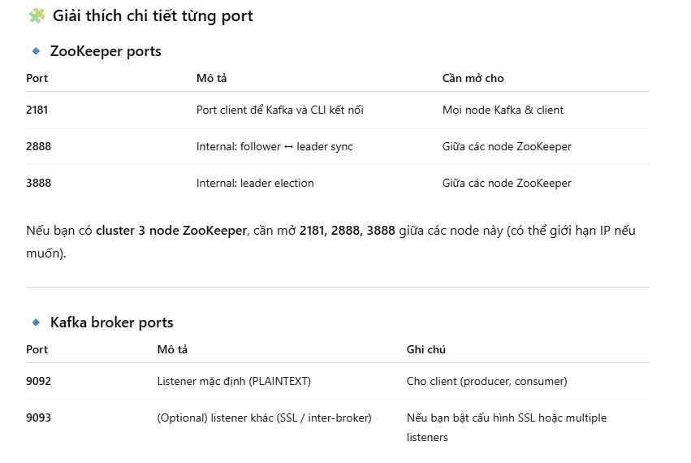
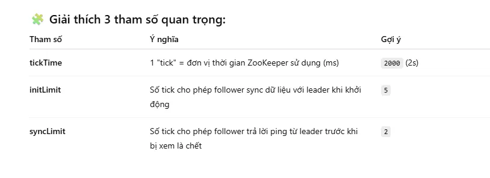

# Kafka HA
## Redhat

Install java

```bash
dnf install -y java-11-openjdk
# check
[root@servere ~]# sudo alternatives --config java

There is 1 program that provides 'java'.

  Selection    Command
-----------------------------------------------
*+ 1           java-11-openjdk.x86_64 (/usr/lib/jvm/java-11-openjdk-11.0.25.0.9-7.el9.x86_64/bin/java)

Enter to keep the current selection[+], or type selection number:         
[root@servere ~]# java --version 
openjdk 11.0.25 2024-10-15 LTS
OpenJDK Runtime Environment (Red_Hat-11.0.25.0.9-1) (build 11.0.25+9-LTS)
OpenJDK 64-Bit Server VM (Red_Hat-11.0.25.0.9-1) (build 11.0.25+9-LTS, mixed mode, sharing)
[root@servere ~]# 

```

Install kafka 3.0.0


```bash
[root@servere ~]# mkdir /opt/kafka
[root@servere ~]# cd /opt/kafka
[root@servere kafka]# wget https://archive.apache.org/dist/kafka/3.0.0/kafka_2.13-3.0.0.tgz
--2025-10-03 08:27:20--  https://archive.apache.org/dist/kafka/3.0.0/kafka_2.13-3.0.0.tgz
Resolving archive.apache.org (archive.apache.org)... 65.108.204.189, 2a01:4f9:1a:a084::2
Connecting to archive.apache.org (archive.apache.org)|65.108.204.189|:443... connected.
HTTP request sent, awaiting response... 200 OK
Length: 86396520 (82M) [application/x-gzip]
Saving to: ‘kafka_2.13-3.0.0.tgz’

kafka_2.13-3.0.0.tgz                                        100%[==========================================================================================================================================>]  82.39M  2.52MB/s    in 51s     

2025-10-03 08:28:12 (1.62 MB/s) - ‘kafka_2.13-3.0.0.tgz’ saved [86396520/86396520]

[root@servere kafka]# ls
kafka_2.13-3.0.0.tgz
[root@servere kafka]# tar -xzf kafka_2.13-3.0.0.tgz 
[root@servere kafka]# ls
kafka_2.13-3.0.0  kafka_2.13-3.0.0.tgz
```

Set permission

```bash
Chạy lệnh sau:

# Tạo user và group kafka (không có quyền login)
useradd -r -m -s /sbin/nologin kafka

# Giải thích:
-r: user hệ thống
-m: tạo home directory /home/kafka
-s /sbin/nologin: không cho login shell

---
chown -R kafka:kafka /opt/kafka
chown -R kafka:kafka /var/lib/zookeeper

mkdir -p /var/log/kafka
chown -R kafka:kafka /var/log/kafka

mkdir -p /var/lib/kafka-logs
chown -R kafka:kafka /var/lib/kafka-logs

```

Modify config systemd 

vi /etc/systemd/system/zookeeper.service

```bash
[Unit]
Description=Apache Zookeeper server
Documentation=http://zookeeper.apache.org
Requires=network.target remote-fs.target
After=network.target remote-fs.target

[Service]
Type=simple
User=kafka
Group=kafka
ExecStart=/usr/bin/bash /opt/kafka/kafka_2.13-3.0.0/bin/zookeeper-server-start.sh /opt/kafka/kafka_2.13-3.0.0/config/zookeeper.properties
ExecStop=/usr/bin/bash /opt/kafka/kafka_2.13-3.0.0/bin/zookeeper-server-stop.sh
Restart=on-abnormal

[Install]
WantedBy=multi-user.target

```

vi /etc/systemd/system/kafka.service

```bash
[Unit]

Description=Apache Kafka Server
Documentation=http://kafka.apache.org/documentation...
Requires=zookeeper.service

[Service]
Type=simple
User=kafka
Group=kafka
Environment="JAVA_HOME=/usr/lib/jvm/java-11-openjdk-11.0.25.0.9-7.el9.x86_64"
ExecStart=/usr/bin/bash /opt/kafka/kafka_2.13-3.0.0/bin/kafka-server-start.sh /opt/kafka/kafka_2.13-3.0.0/config/server.properties
ExecStop=/usr/bin/bash /opt/kafka/kafka_2.13-3.0.0/bin/kafka.server-stop.sh

[Install]
WantedBy=multi-user.target

```

Reload

```bash
systemctl daemon-reload 
systemctl status kafka.service 
systemctl status zookeeper.service

systemctl enable zookeeper.service
systemctl enable kafka.service 
```

Backup

```bash
mkdir /backup_kafka
cp /opt/kafka/kafka_2.13-3.0.0/config/server.properties /backup_kafka
```

Tạo file `myid` trên mỗi node:

```bash
[root@servere kafka_2.13-3.0.0]# vi config/server.properties 

echo "1" > /var/lib/zookeeper/myid  # node 1
echo "2" > /var/lib/zookeeper/myid  # node 2
echo "3" > /var/lib/zookeeper/myid  # node 3

```

Note:

- `broker.id` (trong `server.properties`) 👉 Là **ID của Kafka broker**
- `/var/lib/zookeeper/myid` 👉 Là **ID của ZooKeeper node**

firewall

```bash
# ZooKeeper
firewall-cmd --permanent --add-port=2181/tcp   # client port
firewall-cmd --permanent --add-port=2888/tcp   # follower-leader
firewall-cmd --permanent --add-port=3888/tcp   # election

# Kafka broker
firewall-cmd --permanent --add-port=9092/tcp   # client access port (PLAINTEXT)
# Nếu cluster multi-node (inter-broker communication)
firewall-cmd --permanent --add-port=9093/tcp   # optional, nếu có listeners khác

firewall-cmd --reload

```



vi config/zookeeper.properties 

```bash
dataDir=/var/lib/zookeeper
# the port at which the clients will connect
clientPort=2181
# disable the per-ip limit on the number of connections since this is a non-production config
maxClientCnxns=0
# Disable the adminserver by default to avoid port conflicts.
# Set the port to something non-conflicting if choosing to enable this
admin.enableServer=false
# admin.serverPort=8080
tickTime=2000
initLimit=5
syncLimit=2

# Cluster configuration
server.1=192.168.38.132:2888:3888
server.2=192.168.38.132:2888:3888
server.3=192.168.38.132:2888:3888
[root@servere kafka_2.13-3.0.0]# 

```

```bash
[root@servere kafka_2.13-3.0.0]# cat config/server.properties 
broker.id=0
listeners=PLAINTEXT://192.168.38.130:9092
advertised.listeners=PLAINTEXT://192.168.38.130:9092
log.dirs=/var/lib/kafka-logs
zookeeper.connect=192.168.38.130:2181,192.168.38.132:2181,192.168.38.133:2181

#moi server brokerid lisener khac

```



(Optional) Add to PATH
To use psql directly without typing the full path(For current user only)

```bash
[root@servere kafka_2.13-3.0.0]# echo 'export PATH=/opt/kafka/kafka_2.13-3.0.0/bin:$PATH' >> ~/.bashrc
[root@servere kafka_2.13-3.0.0]# source ~/.bashrc
[root@servere kafka_2.13-3.0.0]# kafka-
kafka-acls.sh                       kafka-metadata-shell.sh
kafka-broker-api-versions.sh        kafka-mirror-maker.sh
kafka-cluster.sh                    kafka-producer-perf-test.sh
kafka-configs.sh                    kafka-reassign-partitions.sh
kafka-console-consumer.sh           kafka-replica-verification.sh
kafka-console-producer.sh           kafka-run-class.sh
kafka-consumer-groups.sh            kafka-server-start.sh
kafka-consumer-perf-test.sh         kafka-server-stop.sh
kafka-delegation-tokens.sh          kafka-storage.sh
kafka-delete-records.sh             kafka-streams-application-reset.sh
kafka-dump-log.sh                   kafka-topics.sh
kafka-features.sh                   kafka-transactions.sh
kafka-get-offsets.sh                kafka-verifiable-consumer.sh
kafka-leader-election.sh            kafka-verifiable-producer.sh
kafka-log-dirs.sh                   
[root@servere kafka_2.13-3.0.0]# kafka-server-start.sh --version
[2025-10-03 10:39:33,840] INFO Registered kafka:type=kafka.Log4jController MBean (kafka.utils.Log4jControllerRegistration$)
3.0.0 (Commit:8cb0a5e9d3441962)

# Or system-wide (all users, all login sessions):
echo 'export PATH=/opt/kafka/kafka_2.13-3.0.0/bin:$PATH' > /etc/profile.d/kafka.sh
chmod +x /etc/profile.d/kafka.sh
source /etc/profile.d/kafka.sh

```


Test

```bash
[root@servere kafka_2.13-3.0.0]# /opt/kafka/kafka_2.13-3.0.0/bin/zookeeper-shell.sh 127.0.0.1:2181
Connecting to 127.0.0.1:2181
Welcome to ZooKeeper!
JLine support is disabled

WATCHER::

WatchedEvent state:SyncConnected type:None path:null
ls /brokers/ids
[0, 1, 2]
ls /
[zookeeper]
create /test_series "series storage"
Created /test_series
get /test_series
series storage
create /test_series/series_1 "11111"
Created /test_series/series_1
get /test_series/series_1
11111

quit

WATCHER::

WatchedEvent state:Closed type:None path:null
[2025-10-03 10:48:38,741] ERROR Exiting JVM with code 0 (org.apache.zookeeper.util.ServiceUtils)
[root@servere kafka_2.13-3.0.0]# 

---
[root@serverf kafka_2.13-3.0.0]# /opt/kafka/kafka_2.13-3.0.0/bin/zookeeper-shell.sh 127.0.0.1:2181
Connecting to 127.0.0.1:2181
Welcome to ZooKeeper!
JLine support is disabled

WATCHER::

WatchedEvent state:SyncConnected type:None path:null
get /test_series  
series storage
ls /test_series           
[series_1]

[root@serverg kafka_2.13-3.0.0]# /opt/kafka/kafka_2.13-3.0.0/bin/zookeeper-shell.sh 127.0.0.1:2181
Connecting to 127.0.0.1:2181
Welcome to ZooKeeper!
JLine support is disabled

WATCHER::

WatchedEvent state:SyncConnected type:None path:null
get /test_series  
series storage
ls /test_series           
[series_1]

```

Port active when done


Test Tạo topic trên server 1:

```bash
[root@servere kafka_2.13-3.0.0]# bin/kafka-topics.sh --create --topic user_activity --bootstrap-server 192.168.38.130:9092 --replication-factor 3 --partitions 6
WARNING: Due to limitations in metric names, topics with a period ('.') or underscore ('_') could collide. To avoid issues it is best to use either, but not both.
Created topic user_activity.
[root@servere kafka_2.13-3.0.0]#  bin/kafka-topics.sh --list --bootstrap-server 192.168.38.130:9092
user_activity
[root@servere kafka_2.13-3.0.0]# 

```

Server 2

```bash
[root@servere kafka_2.13-3.0.0]#  bin/kafka-topics.sh --list --bootstrap-server 192.168.38.130:9092
user_activity
[root@servere kafka_2.13-3.0.0]# 
[root@serverf kafka_2.13-3.0.0]# bin/kafka-topics.sh --list --bootstrap-server 192.168.38.132:9092
user_activity
[root@serverf kafka_2.13-3.0.0]# 
[root@serverg kafka_2.13-3.0.0]# bin/kafka-topics.sh --list --bootstrap-server 192.168.38.133:9092
user_activity
[root@serverg kafka_2.13-3.0.0]# 

```

Xem PID kafka

```bash
[root@servere kafka_2.13-3.0.0]# ps -ef | grep kafka
kafka       1156       1  0 13:46 ?        00:00:07 java -Xmx512M -Xms512M -server -XX:+UseG1GC -XX:MaxGCPauseMillis=20 
```


---
Docs


- https://kafka.apache.org/documentation/#java

- https://dev.to/devopsfundamentals/kafka-fundamentals-kafka-high-availability-37pd

- https://kafka.apache.org/downloads
