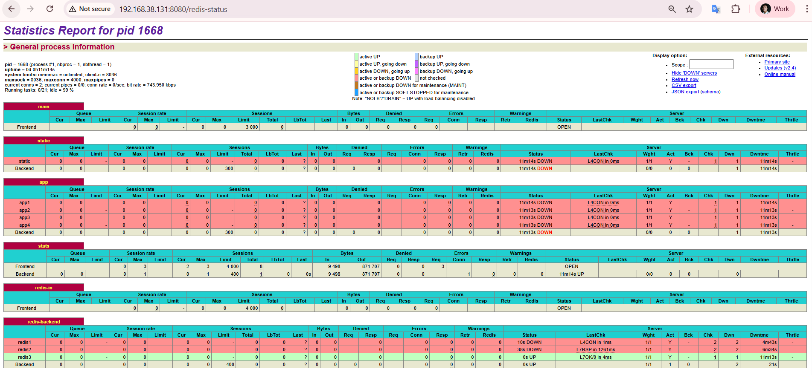

# Redis Sentinel and PostgreSQL 14 Deployment Guide

This document outlines the prerequisites, deployment steps, and verification procedures for setting up Redis (with Sentinel high availability) and PostgreSQL 14, drawing exclusively from the provided technical excerpts.

# 1. Prerequisite

### Compute (OS, Hardware, Storage)

| Component | Requirement | Details | Citation |
| :--- | :--- | :--- | :--- |
| **Operating System** | RHEL 9.x (x86_64) | Red Hat Enterprise Linux 9.x 64-bit architecture | [1] |
| **CPU** | Minimum 2 cores | Recommended 4 cores or more | [1] |
| **Memory (Redis)** | 2 GB RAM or more | Required for Redis operations | [1] |
| **Memory (PostgreSQL)** | 4 GB RAM or more | Required for PostgreSQL operations | [1] |
| **Storage (Redis)** | 10 GB SSD | Must be I/O optimized | [1] |
| **Storage (PostgreSQL)** | 50 GB SSD or more | Required storage capacity | [1] |
| **Disk Format** | XFS or EXT4 | Acceptable file system formats | [1] |

### Network (Firewall, Security, Topology)

| Component | Requirement | Details | Citation |
| :--- | :--- | :--- | :--- |
| **Firewall** | Open required ports | Services require specific ports open for communication. | [1] |
| **Redis Client Port** | 6379 (TCP) | Client connection port | [1] |
| **Redis Sentinel Port** | 26379 (TCP) | Sentinel monitoring and communication port | [1] |
| **PostgreSQL Port** | 5432 (TCP) | PostgreSQL database connection port | [1] |
| **Security (SELinux)** | Enforcing or Permissive | Custom policy should be added for Redis/PostgreSQL if necessary | [1] |
| **Security (Admin)** | SSH key-based access | Recommended for administrative access | [1] |
| **Cluster Network** | VPN or private network | Recommended for cluster nodes [2] |

### Software and Tools

| Component | Version | Role | Citation |
| :--- | :--- | :--- | :--- |
| **Redis** | 6.2.16 | Database software | [1, 3, 4] |
| **PostgreSQL** | 14.0.0 | Database software | [1, 5] |
| **Tools** | psql, redis-cli, redis-sentinel, systemctl | Required utilities for management and operation | [2] |
| **Haproxy** | 2.4.22 |-  | - |


# Triển khai Redis Sentinel với 3 Server

## Mô hình

| Server  | IP             | Role             |
| ------- | -------------- | ---------------- |
| servere | 192.168.38.130 | master + sentinel |
| serverf | 192.168.38.132 | slave + sentinel  |
| serverg | 192.168.38.133 | slave + sentinel  |
| serverd | 192.168.38.131 | haproxy          |
---
## 2. Deployment: Steps

### 2.1. Installation

## 1. Cài đặt Redis trên 3 server

```
[root@servere ~]# yum list redis
 
Updating Subscription Management repositories.
Unable to read consumer identity

This system is not registered with an entitlement server. You can use "rhc" or "subscription-manager" to register.

Last metadata expiration check: 1:37:59 ago on Wed 24 Sep 2025 06:54:07 PM +07.
Installed Packages
redis.x86_64                    6.2.16-1.el9                    @local-redis
```

```
[root@servere ~]# yum list postgresql14
Updating Subscription Management repositories.
Unable to read consumer identity

This system is not registered with an entitlement server. You can use "rhc" or "subscription-manager" to register.

Last metadata expiration check: 1:38:44 ago on Wed 24 Sep 2025 06:54:07 PM +07.
Installed Packages
postgresql14.x86_64                 14.0-1                 @local-postgresql
[root@servere ~]# 

```

1.  **Install Redis and PostgreSQL:**
```
yum install redis.x86_64 -y
yum install postgresql14.x86_64 -y
redis-server --version
Redis server v=6.2.16 sha=00000000:0 malloc=jemalloc-5.1.0 bits=64 build=85a2e85bf3a77649

```
1. Kiểm tra thư viện libpq
ls -l /usr/local/postgresql14/lib/libpq.so*


Bạn sẽ thấy file libpq.so.5 hoặc symlink trỏ đến nó.

2. Thêm thư viện vào hệ thống

Có nhiều cách, thường dùng nhất là cập nhật ld.so.conf:

echo "/usr/local/postgresql14/lib" > /etc/ld.so.conf.d/postgresql14.conf
ldconfig

3. Kiểm tra lại
/usr/local/postgresql14/bin/psql --version


Kết quả mong muốn:

psql (PostgreSQL) 14.0

4. (Tùy chọn) Thêm vào PATH

Để dùng psql trực tiếp thay vì phải gõ đường dẫn dài:
```
echo 'export PATH=/usr/local/postgresql14/bin:$PATH' >> ~/.bashrc
source ~/.bashrc
```
```
[root@servere ~]# psql --version
psql (PostgreSQL) 14.0
[root@servere ~]# 

```


•	Kiểm tra phiên bản Redis:  
```
[root@servere ~]# redis-cli --version
redis-cli 6.2.16
[root@servere ~]# 

```

### Master (servera - 192.168.38.130)
Chỉnh sửa cấu hình: `vi /etc/redis/redis.conf`
```bash
bind 192.168.38.130
requirepass passwd
masterauth passwd
```
Khởi động lại dịch vụ:
```
systemctl restart redis
systemctl enable redis
```

Kiểm tra:
```
redis-cli
auth passwd
info replication
```

### Slave (serverb - 192.168.38.132)
Chỉnh sửa cấu hình: `vi /etc/redis/redis.conf`
```
bind 192.168.38.132
replicaof 192.168.38.130 6379
protected-mode no
daemonize no
masterauth passwd
requirepass passwd
```

Khởi động lại dịch vụ:
```
systemctl restart redis
systemctl enable redis
```

**Kiểm tra vai trò:**
```
[root@serverg ~]# redis-cli -h 192.168.38.133 -p 6379
192.168.38.133:6379> auth passwd
OK
192.168.38.133:6379> info replication
# Replication
role:master
connected_slaves:2
slave0:ip=192.168.38.132,port=6379,state=online,offset=253710,lag=1
slave1:ip=192.168.38.130,port=6379,state=online,offset=253710,lag=0
master_failover_state:no-failover
master_replid:e704b4e1eba47d4931549090ba513dbf910c504b
master_replid2:6e8863c12def62ad03ae109d7b9453c2a3e01187
master_repl_offset:253853
second_repl_offset:8969
repl_backlog_active:1
repl_backlog_size:1048576
repl_backlog_first_byte_offset:1
repl_backlog_histlen:253853
192.168.38.133:6379> 

```

Firewall  
Master-slave
```bash
[root@servere ~]# systemctl status firewalld.service 
● firewalld.service - firewalld - dynamic firewall daemon
     Loaded: loaded (/usr/lib/systemd/system/firewalld.service; enabled; pr>
     Active: active (running) since Wed 2025-09-24 19:54:52 +07; 23min ago
       Docs: man:firewalld(1)
   Main PID: 2743 (firewalld)
      Tasks: 4 (limit: 10706)
     Memory: 29.7M
        CPU: 1.086s
     CGroup: /system.slice/firewalld.service
             └─2743 /usr/bin/python3 -s /usr/sbin/firewalld --nofork --nopid

Sep 24 19:54:52 servere systemd[1]: Starting firewalld - dynamic firewall d>
Sep 24 19:54:52 servere systemd[1]: Started firewalld - dynamic firewall da>
lines 1-13/13 (END)

firewall-cmd --permanent --add-rich-rule='rule family="ipv4" source address="192.168.38.0/24" port port=6379 protocol=tcp accept'

firewall-cmd --permanent --add-rich-rule='rule family="ipv4" source address="192.168.38.0/24" port port=26379 protocol=tcp accept'

firewall-cmd --reload
```


### Kiểm tra đồng bộ hóa
Trên máy Master, thêm 1 key value
```
redis-cli -h 192.168.38.130
SET key1 "Hello from Master"
``` 
Trên máy Slave, kiểm tra dữ liệu: 
```
redis-cli
GET key1
```
Nếu kết quả trả về "Hello from Master", đồng bộ hóa hoạt động bình thường


---
## 2. Cấu hình Sentinel trên 3 server 
```bash
port 26379
daemonize no
protected-mode no
bind 192.168.38.132

sentinel monitor mymaster 192.168.38.132 6379 2
sentinel down-after-milliseconds mymaster 10000
sentinel failover-timeout mymaster 60000
sentinel parallel-syncs mymaster 2
sentinel auth-pass mymaster passwd
requirepass "password"
sentinel sentinel-pass password
```
Để chạy Sentinel dưới dạng dịch vụ hệ thống: 
Tạo file dịch vụ (ví dụ: /etc/systemd/system/redis-sentinel.service): 
```bash

[root@servere ~]# which redis-server
/usr/bin/redis-server
[root@servere ~]# 


[root@servere ~]# cat /etc/systemd/system/redis-sentinel.service
[Unit]
Description=Redis Sentinel
After=network.target

[Service]
ExecStart=/usr/bin/redis-server /etc/redis/sentinel.conf --sentinel
User=redis
Group=redis

[Install]
WantedBy=multi-user.target

```
Kiem tra Sentinel
o	Kích hoạt và khởi động dịch vụ: 
```
systemctl daemon-reload
sudo systemctl enable redis-sentinel
sudo systemctl start redis-sentinel
```

•	Kết nối đến một Sentinel: 
```
redis-cli -h <sentinel_ip> -p 26379
```
•	Kiểm tra trạng thái master: 
```
SENTINEL GET-MASTER-ADDR-BY-NAME mymaster
```
Kết quả sẽ trả về IP và port của master hiện tại (ví dụ: 192.168.1.10 6379).
•	Kiểm tra danh sách Sentinel: 
```
SENTINEL SENTINELS mymaster
```
Or
```
[root@serverf ~]# redis-cli -h 192.168.38.132 -p 26379 SENTINEL GET-MASTER-ADDR-BY-NAME mymaster
1) "192.168.38.132"
2) "6379"
[root@serverf ~]# redis-cli -h 192.168.38.132 -p 26379 SENTINEL SENTINELS mymaster
1)  1) "name"
    2) "97e1c87dbbeec2322dd5ce2a62ef2cc30757a4e7"
    3) "ip"
    4) "192.168.38.130"
    5) "port"
    6) "26379"
    7) "runid"
    8) "97e1c87dbbeec2322dd5ce2a62ef2cc30757a4e7"
    9) "flags"
   10) "sentinel"
   11) "link-pending-commands"
   12) "0"
   13) "link-refcount"
   14) "1"
   15) "last-ping-sent"
   16) "0"
   17) "last-ok-ping-reply"
   18) "168"
   19) "last-ping-reply"
   20) "168"
   21) "down-after-milliseconds"
   22) "30000"
   23) "last-hello-message"
   24) "257"
   25) "voted-leader"
   26) "?"
   27) "voted-leader-epoch"
   28) "1"
2)  1) "name"
    2) "78358f926f1cebdcd07f43f4bc7e1dfb10f65f43"
    3) "ip"
    4) "192.168.38.133"
    5) "port"
    6) "26379"
    7) "runid"
    8) "78358f926f1cebdcd07f43f4bc7e1dfb10f65f43"
    9) "flags"
   10) "sentinel"
   11) "link-pending-commands"
   12) "0"
   13) "link-refcount"
   14) "1"
   15) "last-ping-sent"
   16) "0"
   17) "last-ok-ping-reply"
   18) "168"
   19) "last-ping-reply"
   20) "168"
   21) "down-after-milliseconds"
   22) "30000"
   23) "last-hello-message"
   24) "1185"
   25) "voted-leader"
   26) "?"
   27) "voted-leader-epoch"
   28) "1"
[root@serverf ~]# 


```

Server Seninel
```
firewall-cmd --permanent --add-rich-rule='rule family="ipv4" source address="192.168.38.0/24" port port=6379 protocol=tcp accept'

firewall-cmd --permanent --add-rich-rule='rule family="ipv4" source address="192.168.38.0/24" port port=26379 protocol=tcp accept'

firewall-cmd --reload

firewall-cmd --list-all
public (active)
  target: default
  icmp-block-inversion: no
  interfaces: ens160
  sources: 
  services: cockpit dhcpv6-client ssh
  ports: 
  protocols: 
  forward: yes
  masquerade: no
  forward-ports: 
  source-ports: 
  icmp-blocks: 
  rich rules: 
	rule family="ipv4" source address="192.168.38.0/24" port port="6379" protocol="tcp" accept
	rule family="ipv4" source address="192.168.38.0/24" port port="26379" protocol="tcp" accept

[root@servere ~]# netstat -tulpn | grep redis
tcp        0      0 192.168.38.130:6379     0.0.0.0:*               LISTEN      2132/redis-server 1 
tcp        0      0 192.168.38.130:26379    0.0.0.0:*               LISTEN      1976/redis-server 1 
[root@servere ~]# 

```

## Test Failover

```
[root@serverf ~]# tail /var/log/redis/sentinel.log 
1992:X 24 Sep 2025 19:53:15.945 # +failover-state-reconf-slaves master mymaster 192.168.38.130 6379
1992:X 24 Sep 2025 19:53:15.996 # +failover-end master mymaster 192.168.38.130 6379
1992:X 24 Sep 2025 19:53:15.996 # +switch-master mymaster 192.168.38.130 6379 192.168.38.132 6379
1992:X 24 Sep 2025 19:53:15.996 * +slave slave 192.168.38.130:6379 192.168.38.130 6379 @ mymaster 192.168.38.132 6379
1992:X 24 Sep 2025 19:53:46.014 # +sdown slave 192.168.38.130:6379 192.168.38.130 6379 @ mymaster 192.168.38.132 6379
1992:X 24 Sep 2025 19:55:24.093 # +sdown sentinel 97e1c87dbbeec2322dd5ce2a62ef2cc30757a4e7 192.168.38.130 26379 @ mymaster 192.168.38.132 6379
1992:X 24 Sep 2025 19:55:40.752 # +sdown sentinel 78358f926f1cebdcd07f43f4bc7e1dfb10f65f43 192.168.38.133 26379 @ mymaster 192.168.38.132 6379
1992:X 24 Sep 2025 19:59:51.101 # -sdown sentinel 97e1c87dbbeec2322dd5ce2a62ef2cc30757a4e7 192.168.38.130 26379 @ mymaster 192.168.38.132 6379
1992:X 24 Sep 2025 20:00:06.972 # +new-epoch 2
1992:X 24 Sep 2025 20:00:07.500 # -sdown sentinel 78358f926f1cebdcd07f43f4bc7e1dfb10f65f43 192.168.38.133 26379 @ mymaster 192.168.38.132 6379

```
```bash
# Server master
[root@servere ~]# systemctl stop redis

# Server bat ky - server slave
[root@serverb ~]# redis-cli -h 192.168.38.130 -p 26379
192.168.38.130:26379> SENTINEL GET-MASTER-ADDR-BY-NAME mymaster
1) "192.168.38.130"
2) "6379"
192.168.38.130:26379> SENTINEL SENTINELS mymaster
1)  1) "name"
    2) "2ffdb2d0ebde9d1e5b87c92cb3ace6801a28bdca"
    3) "ip"
    4) "192.168.38.133"
    5) "port"
    6) "26379"
    ...
2)  1) "name"
    2) "ef4e3230f8b417b417da1147caa40aba230b269a"
    3) "ip"
    4) "192.168.38.132"
    5) "port"
    6) "26379"
    ...
 

```
```
[root@serverg ~]# tail /var/log/redis/sentinel.log 
1969:X 25 Sep 2025 10:22:38.210 * +reboot slave 192.168.38.133:6379 192.168.38.133 6379 @ mymaster 192.168.38.130 6379
1969:X 25 Sep 2025 10:23:23.231 # +sdown master mymaster 192.168.38.130 6379
1969:X 25 Sep 2025 10:23:23.318 # +new-epoch 4
1969:X 25 Sep 2025 10:23:23.320 # +vote-for-leader fbbc29d5679414130d934cc582882a4ef75fb544 4
1969:X 25 Sep 2025 10:23:23.793 # +config-update-from sentinel fbbc29d5679414130d934cc582882a4ef75fb544 192.168.38.132 26379 @ mymaster 192.168.38.130 6379
1969:X 25 Sep 2025 10:23:23.793 # +switch-master mymaster 192.168.38.130 6379 192.168.38.133 6379
1969:X 25 Sep 2025 10:23:23.794 * +slave slave 192.168.38.132:6379 192.168.38.132 6379 @ mymaster 192.168.38.133 6379
1969:X 25 Sep 2025 10:23:23.794 * +slave slave 192.168.38.130:6379 192.168.38.130 6379 @ mymaster 192.168.38.133 6379
1969:X 25 Sep 2025 10:23:33.823 # +sdown slave 192.168.38.130:6379 192.168.38.130 6379 @ mymaster 192.168.38.133 6379
1969:X 25 Sep 2025 10:24:38.915 # -sdown slave 192.168.38.130:6379 192.168.38.130 6379 @ mymaster 192.168.38.133 6379
[root@serverg ~]# 

```

```
[root@servere ~]# redis-cli -h 192.168.38.133 -a passwd 
Warning: Using a password with '-a' or '-u' option on the command line interface may not be safe.
192.168.38.133:6379> info replication
# Replication
role:master
connected_slaves:2
slave0:ip=192.168.38.132,port=6379,state=online,offset=157842,lag=1
slave1:ip=192.168.38.130,port=6379,state=online,offset=157985,lag=0
master_failover_state:no-failover
master_replid:e704b4e1eba47d4931549090ba513dbf910c504b
master_replid2:6e8863c12def62ad03ae109d7b9453c2a3e01187
master_repl_offset:157985
second_repl_offset:8969
repl_backlog_active:1
repl_backlog_size:1048576
repl_backlog_first_byte_offset:1
repl_backlog_histlen:157985
192.168.38.133:6379> 

```
```
[root@serverg ~]# redis-cli -h 192.168.38.133 -p 26379
192.168.38.133:26379> SENTINEL GET-MASTER-ADDR-BY-NAME mymaster
1) "192.168.38.133"
2) "6379"
192.168.38.133:26379> SENTINEL SENTINELS mymaster
1)  1) "name"
    2) "97e1c87dbbeec2322dd5ce2a62ef2cc30757a4e7"
    3) "ip"
    4) "192.168.38.130"
    5) "port"
    6) "26379"
    7) "runid"
    8) "97e1c87dbbeec2322dd5ce2a62ef2cc30757a4e7"
    9) "flags"
   10) "sentinel"
   11) "link-pending-commands"
   12) "0"
   13) "link-refcount"
   14) "1"
   15) "last-ping-sent"
   16) "0"
   17) "last-ok-ping-reply"
   18) "333"
   19) "last-ping-reply"
   20) "333"
   21) "down-after-milliseconds"
   22) "10000"
   23) "last-hello-message"
   24) "131"
   25) "voted-leader"
   26) "?"
   27) "voted-leader-epoch"
   28) "0"
2)  1) "name"
    2) "fbbc29d5679414130d934cc582882a4ef75fb544"
    3) "ip"
    4) "192.168.38.132"
    5) "port"
    6) "26379"
    7) "runid"
    8) "fbbc29d5679414130d934cc582882a4ef75fb544"
    9) "flags"
   10) "sentinel"
   11) "link-pending-commands"
   12) "0"
   13) "link-refcount"
   14) "1"
   15) "last-ping-sent"
   16) "0"
   17) "last-ok-ping-reply"
   18) "332"
   19) "last-ping-reply"
   20) "332"
   21) "down-after-milliseconds"
   22) "10000"
   23) "last-hello-message"
   24) "1150"
   25) "voted-leader"
   26) "?"
   27) "voted-leader-epoch"
   28) "0"
192.168.38.133:26379> 
```


- Cần làm rõ việc bind - service -firewall 
- giải thích vài tham số cấu hình
- đặt passwod base64
- cần tối thiểu mô hình như nào
- Master: Cho phép read/write. Slave: Chỉ cho phép read. Sentinel: Không truy cập dữ liệu, chỉ giám sát và điều phối failove

Haproxy

```
[root@serverd ~]# yum list haproxy
Updating Subscription Management repositories.
Unable to read consumer identity

This system is not registered with an entitlement server. You can use "rhc" or "subscription-manager" to register.

Installed Packages
haproxy.x86_64 2.4.22-4.el9 @rhel-9-for-x86_64-appstream-rpms
```
```
yum install haproxy.x86_64 -y
```

```
vi /etc/haproxy/haproxy.cfg
defaults redis
    mode tcp
    timeout connect 0s
    timeout server 0s
    timeout client 0s
    timeout check 3s
listen stats # Define a listen section called "stats"
  bind *:8080
  mode http
  stats enable                        # Enable stats page
  stats hide-version                  # Hide HAProxy version
  stats realm HAProxy\ Statistics     # Title text for popup window
  stats uri /redis-status            # Stats URI
frontend redis-in
    bind *:6379
    default_backend redis-backend
backend redis-backend
    option tcp-check
    tcp-check connect
    tcp-check send AUTH\ passwd\r\n
    tcp-check expect string +OK
    tcp-check send PING\r\n
    tcp-check expect string +PONG
    tcp-check send info\ replication\r\n
    tcp-check expect string role:master
    tcp-check send QUIT\r\n
    tcp-check expect string +OK
    server redis1 192.168.38.130:6379 check inter 1s downinter 1s fastinter 1s fall 1 rise 1
    server redis2 192.168.38.132:6379 check inter 1s downinter 1s fastinter 1s fall 1 rise 1
    server redis3 192.168.38.133:6379 check inter 1s downinter 1s fastinter 1s fall 1 rise 1
[root@serverd ~]# 
```

```
systemctl enable haproxy.service 
systemctl status haproxy.service 
systemctl start haproxy.service
```

