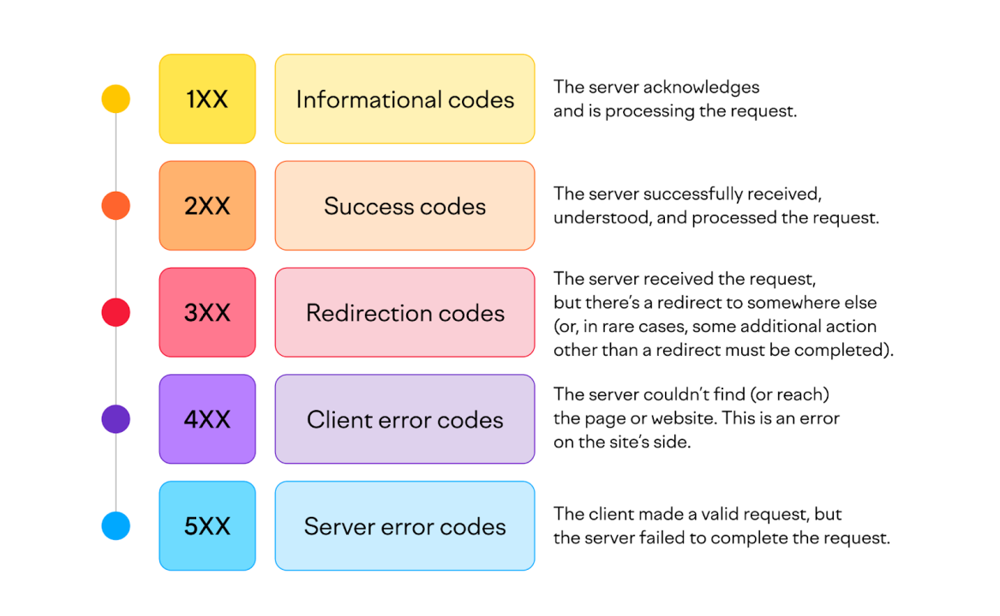

Understand HTTP protocol basics (methods, headers, status codes)

🔹 HTTP là gì?

HTTP (HyperText Transfer Protocol) là giao thức truyền tải siêu văn bản giữa client (trình duyệt, ứng dụng) và server (máy chủ web).

| Phương thức | Mô tả |
| --- | --- |
| GET | Lấy dữ liệu từ server |
| POST | Gửi dữ liệu tới server để xử lý |
| PUT | Cập nhật toàn bộ tài nguyên |
| PATCH | Cập nhật một phần tài nguyên |
| DELETE | Xóa tài nguyên trên server |
| HEAD | Giống GET nhưng không trả nội dung |
| OPTIONS | Lấy thông tin về các phương thức được hỗ trợ |

🔹 Các **tiêu đề (headers)** HTTP cơ bản:

- `Content-Type`: Kiểu dữ liệu gửi/nhận (e.g. `application/json`)
- `Authorization`: Thông tin xác thực (e.g. Bearer token)
- `User-Agent`: Mô tả trình duyệt/ứng dụng đang gửi yêu cầu
- `Accept`: Xác định client muốn nhận dữ liệu dưới định dạng gì
- `Cache-Control`: Chỉ dẫn liên quan đến cache

🔹 **Mã trạng thái (status codes)** HTTP:

| Mã | Nhóm | Ý nghĩa |
| --- | --- | --- |
| 200 | Thành công | OK |
| 201 | Thành công | Created |
| 400 | Lỗi client | Bad Request |
| 401 | Lỗi client | Unauthorized |
| 403 | Lỗi client | Forbidden |
| 404 | Lỗi client | Not Found |
| 500 | Lỗi server | Internal Server Error |
| 503 | Lỗi server | Service Unavailable |



---

Explore gRPC concepts and architecture

### 🔹 gRPC là gì?

gRPC là một framework RPC (Remote Procedure Call) mã nguồn mở do Google phát triển, sử dụng HTTP/2 và Protocol Buffers (protobuf) để truyền dữ liệu hiệu quả.

### 🔹 Đặc điểm của gRPC:

- **Hiệu suất cao**: Dựa trên HTTP/2, truyền song song, nén header.
- **Giao tiếp đa dạng**:
    - Unary (1 request - 1 response)
    - Server streaming (1 request - nhiều response)
    - Client streaming (nhiều request - 1 response)
    - Bidirectional streaming (nhiều request - nhiều response)
- **Ngôn ngữ đa nền tảng**: Hỗ trợ C++, Java, Python, Go, Node.js...
- **IDL**: Sử dụng file `.proto` để định nghĩa dịch vụ và message.

### 🔹 Kiến trúc gRPC:

```protobuf
// example.proto
syntax = "proto3";

service Greeter {
  rpc SayHello (HelloRequest) returns (HelloReply);
}

message HelloRequest {
  string name = 1;
}

message HelloReply {
  string message = 1;
}
```

- **Client stub** gọi các hàm từ xa như gọi hàm cục bộ.
- **Server** xử lý logic thực tế.

---

Compare HTTP vs gRPC (performance, use cases)

| Tiêu chí | HTTP (RESTful) | gRPC |
| --- | --- | --- |
| Kiểu truyền dữ liệu | JSON (text-based) | Protocol Buffers (binary) |
| Hiệu suất | Tốt, nhưng kém hơn gRPC | Rất cao, nhờ HTTP/2 và protobuf |
| Streaming | Hạn chế (WebSocket nếu cần) | Hỗ trợ streaming tự nhiên |
| Khả năng kiểm tra (debug) | Dễ (dùng Postman, curl) | Khó hơn vì dùng binary |
| Tương thích trình duyệt | Rất tốt | Không trực tiếp (cần proxy) |
| Dễ học / phổ biến | Rất phổ biến | Phức tạp hơn |

✅ **Sử dụng HTTP/REST khi:**

- Cần tương thích trình duyệt
- Hệ thống đơn giản, không yêu cầu hiệu suất cao

✅ **Sử dụng gRPC khi:**

- Giao tiếp giữa microservices
- Yêu cầu tốc độ và hiệu suất cao
- Có thể dùng trên backend, không cần hỗ trợ trình duyệt

---

Access remote systems using SSH

---

Log in and switch users in multiuser targets

---

Understand socket programming concepts (TCP, UDP)

🔹 Socket là gì?

Socket là điểm cuối trong giao tiếp mạng giữa 2 thiết bị (IP + Port).

Mô hình Client–Server

Với TCP:

- **Server**: tạo socket, bind đến port, listen, accept kết nối từ client.
- **Client**: tạo socket, connect đến server, gửi/nhận dữ liệu.

Với UDP:

- **Server**: tạo socket, bind đến port, nhận gói tin từ client.
- **Client**: tạo socket, gửi gói tin đến địa chỉ IP và port của server.

🔹 Giao thức TCP (Transmission Control Protocol):

- **Kết nối (connection-oriented)**: Cần bắt tay 3 bước (3-way handshake)
- **Đảm bảo độ tin cậy**: Gói tin được kiểm tra, sắp xếp lại nếu bị mất/lộn
- **Chậm hơn UDP**, nhưng an toàn hơn
- Loại socket: stream socket

🔹 Giao thức UDP (User Datagram Protocol):

- **Không kết nối (connectionless)**: Không có xác nhận, không đảm bảo đến
- **Nhanh**, nhưng **không đáng tin cậy**
- Loai socket: datagram socket
- Thường dùng cho:
    - Streaming video/audio
    - Game real-time
    - DNS query

---

Implement socket communication (Python/C++)

https://viblo.asia/p/lap-trinh-socket-bang-python-jvEla084Zkw

Cach test

1. Chạy server.
2. Chạy client, nhập tên file tồn tại (ví dụ: data.txt).

fileserver.py 

```bash
# fileserver.py
import os
print("Current working directory:", os.getcwd())

import socket 

host = 'localhost'
port = 6767

s = socket.socket(socket.AF_INET, socket.SOCK_STREAM)
s.bind((host, port))
s.listen(1)
print("Server listening on port", port)

c, addr = s.accept()

#Nhận tên file do client gửi tới
filename = c.recv(1024).decode()
try:
  f =  open(filename, 'rb')
  content = f.read()
  
  # Gửi dữ liệu trong file cho client
  c.send(content)
  f.close()
  
except FileExistsError:
  c.send(b"File not found") #nếu file không tồn tại bảo với client rằng "File not found"
  
c.close()

```

fileclient.py

```bash
# fileclient.py

import socket 
s = socket.socket()
s.connect(("localhost", 6767)) #lắng nghe ở cổng 6767

#Nhập vào tên file 
filename = input("Enter a filename ")

#Gửi tên file cho server
s.send(filename.encode())

#Nhận được dữ liệu từ server gửi tới
content = s.recv(1024)

print(content.decode())
s.close()

```

```bash
    Directory: C:\Users\admin\Code VSC\Socket

Mode                 LastWriteTime         Length Name
----                 -------------         ------ ----
-a----          8/6/2025   3:56 PM            324 client.py
-a----          8/6/2025   4:54 PM             56 data.txt
-a----          8/6/2025   4:57 PM            361 fileclient.py
-a----          8/6/2025   4:57 PM            650 fileserver.py
-a----          8/6/2025   3:56 PM            630 server.py
```

Dựa vào đoạn mã bạn cung cấp, chương trình của bạn đang sử dụng **TCP socket**. Dưới đây là cách nhận biết và phân tích:

## ✅ Dấu hiệu đây là TCP

- Dòng `socket.socket(socket.AF_INET, socket.SOCK_STREAM)` sử dụng `SOCK_STREAM`, tức là **TCP**.
- Server sử dụng `listen()` và `accept()` – đây là cơ chế thiết lập kết nối trong TCP.
- Client sử dụng `connect()` để thiết lập kết nối với server.
- Dữ liệu được gửi bằng `send()` và nhận bằng `recv()` – đặc trưng của TCP.

## 📦 Tổng quan hoạt động

### Server (`fileserver.py`):

- Tạo socket TCP.
- Lắng nghe kết nối từ client.
- Nhận tên file từ client.
- Đọc nội dung file và gửi về cho client.

### Client (`fileclient.py`):

- Tạo socket TCP.
- Kết nối đến server.
- Gửi tên file cần lấy.
- Nhận nội dung file và hiển thị.

## 🔍 Nếu là UDP thì sẽ khác gì?

Nếu bạn muốn chuyển sang UDP, bạn sẽ cần:

- Dùng `socket.SOCK_DGRAM` thay vì `SOCK_STREAM`.
- Không dùng `listen()` hay `accept()` – vì UDP không thiết lập kết nối.
- Dùng `sendto()` và `recvfrom()` thay vì `send()` và `recv()`.

Ví dụ UDP client:

```bash
s = socket.socket(socket.AF_INET, socket.SOCK_DGRAM)
s.sendto(filename.encode(), ('localhost', 6767))
data, addr = s.recvfrom(1024)
```

---