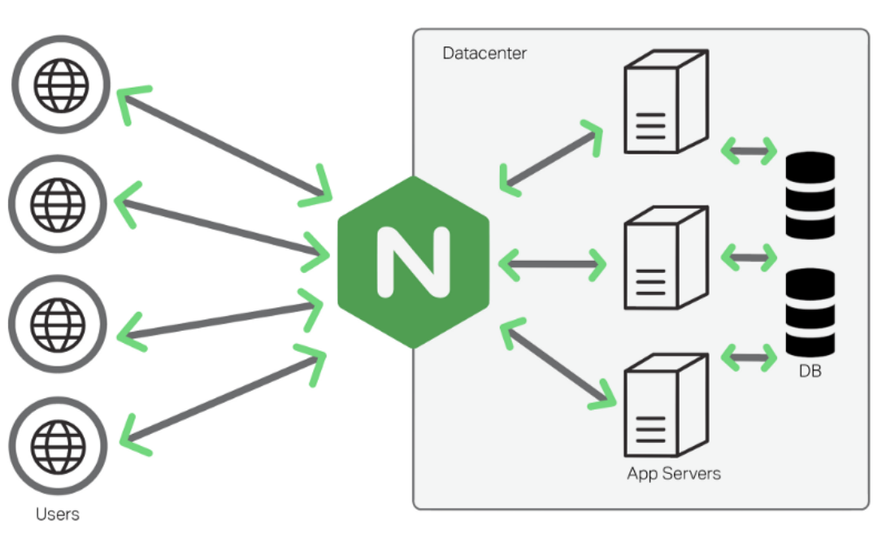
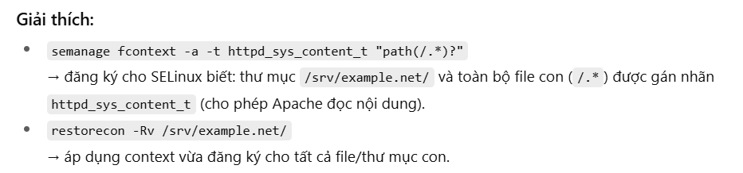

Required:
- Install and configure Nginx & Apache
- Load balancing with HAProxy
- Failover setup using Keepalived & Virtual IP

---
**NGINX**  
NGINX là một web server mạnh mẽ mã nguồn mở. Nginx sử dụng kiến trúc đơn luồng, hướng sự kiện vì thế nó hiệu quả hơn Apache server. Bên cạnh đó, nhờ vào các khả năng của máy chủ HTTP mà NGINX còn có thể hoạt dộng như một proxy server cho email (IMAP, POP3, và SMTP), reverse proxy, và trung gian để cân bằng tải cho các máy chủ HTTP, TCP, và UDP.


**Những tính năng của máy chủ HTTP Nginx**:
- Có khả năng xử lý hơn 10.000 kết nối cùng lúc với bộ nhớ thấp.
- Phục vụ tập tin tĩnh (static files) và lập chỉ mục tập tin.
- Tăng tốc reverse proxy bằng bộ nhớ đệm (cache), cân bằng tải đơn giản và khả năng chịu lỗi.
- Hỗ trợ tăng tốc với bộ nhớ đệm của FastCGI, uwsgi, SCGI, và các máy chủ memcached.
- Kiến trúc modular, tăng tốc độ nạp trang bằng nén gzip tự động.
- Hỗ trợ mã hoá SSL và TLS.
- Cấu hình linh hoạt; lưu lại nhật ký truy vấn
- Chuyển hướng lỗi 3XX-5XX
- Rewrite URL (URL rewriting) dùng regular expressions
- Hạn chế tỷ lệ đáp ứng truy vấn
- Giới hạn số kết nối đồng thời hoặc truy vấn từ 1 địa chỉ
- Khả năng nhúng mã PERL
- Hỗ trợ và tương thích với IPv6
- Hỗ trợ WebSockets
- Hỗ trợ truyền tải file FLV và MP4

**APACHE**  
Máy chủ HTTP Apache, httpd, là một máy chủ web mã nguồn mở do Apache Software Foundation phát triển.


---
**Chapter 2. Setting up and configuring NGINX**    
Để cài đặt một gói Debian dựng sẵn:
```
yum install nginx
```
Kiểm tra version
```
sudo nginx -v
```
Mở các cổng mà NGINX sẽ cung cấp dịch vụ trong firewall. Ví dụ: để mở các cổng mặc định cho HTTP (cổng 80) và HTTPS (cổng 443) trong `firewalld`:
```
firewall-cmd --permanent --add-port={80/tcp,443/tcp}
firewall-cmd --reload
```
Cho phép dịch vụ nginx tự động khởi động khi hệ thống khởi động:
```
systemctl enable nginx
```
Start the nginx service:
```
systemctl start nginx
```
**2.2 Configuring NGINX as a web server that provides different content for different domains**  
Edit the `/etc/nginx/nginx.conf` file  
Append a similar `server` block for the `example.com` domain to the http block:
```
server {
    server_name  example.com;
    root         /var/www/example.com/;
    access_log   /var/log/nginx/example.com/access.log;
    error_log    /var/log/nginx/example.com/error.log;
}
```
- `access_log` định nghĩa một tệp nhật ký truy cập riêng cho domain này. 
- `error_log` định nghĩa một tệp nhật ký lỗi riêng cho domain này  

Append a similar `server` block for the `example.net` domain to the http block:
```
server {
    server_name  example.net;
    root         /var/www/example.net/;
    access_log   /var/log/nginx/example.net/access.log;
    error_log    /var/log/nginx/example.net/error.log;
}
```
Create the root directories for both domains:
```
mkdir -p /var/www/example.com/
mkdir -p /var/www/example.net/

---
# echo "Content for example.com" > /var/www/example.com/index.html
# echo "Content for example.net" > /var/www/example.net/index.html
```
Set the `httpd_sys_content_t` context on both root directories:
```
semanage fcontext -a -t httpd_sys_content_t "/var/www/example.com(/.*)?"
restorecon -Rv /var/www/example.com/

semanage fcontext -a -t httpd_sys_content_t "/var/www/example.net(/.\*)?"
restorecon -Rv /var/www/example.net/
```
Create the `log` directories for both domains:
```bash
mkdir /var/log/nginx/example.com/
mkdir /var/log/nginx/example.net/
```
Restart the nginx service:
```bash
systemctl restart nginx
```
**2.3 Adding TLS encryption to an NGINX web server**  
Prerequisites  
- The private key is stored in the `/etc/pki/tls/private/example.com.key` file.
- The TLS certificate is stored in the `/etc/pki/tls/certs/example.com.crt` file.

Edit the `/etc/nginx/nginx.conf `file
```bash
server {
    listen              443 ssl;
    server_name         example.com;
    root                /usr/share/nginx/html;
    ssl_certificate     /etc/pki/tls/certs/example.com.crt;
    ssl_certificate_key /etc/pki/tls/private/example.com.key;
}
```
For security reasons, configure that only the root user can access the private key file:
```bash
chown root:root /etc/pki/tls/private/example.com.key
chmod 600 /etc/pki/tls/private/example.com.key
```
Restart the nginx service:
```bash
systemctl restart nginx
```

**2.4. Configuring NGINX as a reverse proxy for the HTTP traffic**  
Edit the `/etc/nginx/nginx.conf` file, add the following settings to the server block that should provide the reverse proxy:
```
server {
   ...
   location /example {
   proxy_pass https://example.com;
   }
   ...
}
```
Đặt tham số boolean `httpd_can_network_connect` SELinux thành 1 để cấu hình SELinux cho phép NGINX chuyển tiếp lưu lượng:
```
setsebool -P httpd_can_network_connect 1
```
Restart the nginx service:
```
systemctl restart nginx
```

**2.5 Configuring NGINX as an HTTP load balancer**
```
http {
    upstream backend {
        least_conn;
        server server1.example.com;
        server server2.example.com;
        server server3.example.com backup;
    }

    server {
        location / {
            proxy_pass http://backend;
        }
    }
}
```
NGINX sẽ phân phối request tới các server này theo thuật toán Load Balancing:
- Round Robin (mặc định)
  - Request phân phối lần lượt đều nhau:
    Client 1 → server1, Client 2 → server2, Client 3 → server1, …
  - Dùng khi các server backend có cấu hình tương tự.
- least_conn
  - Request đi đến server có ít kết nối đang xử lý nhất.
  - Dùng khi backend xử lý request lâu, không muốn dồn tải vào một server.
- ip_hash
  - Dựa trên IP client → cùng một client luôn vào cùng một server.
  - Dùng khi server cần giữ session cho client (VD: giỏ hàng, login session).
- hash <key [consistent]
  - Dựa trên giá trị tự chọn (VD: cookie, user_id, request URI…).
  - consistent = thuật toán hash nhất quán → nếu thêm/bớt server thì phân phối request ít bị xáo trộn.
  - Dùng trong hệ thống phân tán, cache, hoặc microservices.
- random
  - Request được gửi tới một server ngẫu nhiên.
  - Có thể thêm `two` để chọn ngẫu nhiên 2 server, rồi so sánh tải (tối ưu hơn).

Restart the nginx service:
```
systemctl restart nginx
```

Docs: https://docs.redhat.com/en/documentation/red_hat_enterprise_linux/8/html/deploying_different_types_of_servers/setting-up-and-configuring-nginx_deploying-different-types-of-servers

---
**Chapter 1. Setting up the Apache HTTP web server**    
**1.4 The Apache configuration files**  
Các tệp cấu hình dịch vụ httpd
Path | Description
---|---
`/etc/httpd/conf/httpd.conf` | Tệp cấu hình chính.
`/etc/httpd/conf.d/` | Thư mục phụ trợ cho các tệp cấu hình có trong tệp cấu hình chính.
`/etc/httpd/conf.modules.d/` | Một thư mục phụ trợ cho các tệp cấu hình tải các mô-đun động đã cài đặt được đóng gói trong Red Hat Enterprise Linux. Trong cấu hình mặc định, các tệp cấu hình này được xử lý trước.

**1.5 Managing the httpd service**    
To start the httpd service:
```
systemctl start httpd
```
To stop the httpd service:
```
systemctl stop httpd
```
To restart the httpd service:
```
 systemctl restart httpd
```
Kiểm tra cấu hình để tìm lỗi có thể xảy ra
```
apachectl configtest

Syntax OK
```
**1.6 Setting up a single-instance Apache HTTP Server**  
Install the httpd package:
```
yum install httpd
```
Open the TCP port 80 in the local firewall:
```
firewall-cmd --permanent --add-port=80/tcp
firewall-cmd --reload
```
Enable and start the httpd service:
```
systemctl enable --now httpd
```
**1.7. Configuring Apache name-based virtual hosts**   
Edit the `/etc/httpd/conf/httpd.conf` file:
```
<VirtualHost *:80>
    DocumentRoot "/var/www/example.com/"
    ServerName example.com
    CustomLog /var/log/httpd/example.com_access.log combined
    ErrorLog /var/log/httpd/example.com_error.log
</VirtualHost>

<VirtualHost *:80>
    DocumentRoot "/var/www/example.net/"
    ServerName example.net
    CustomLog /var/log/httpd/example.net_access.log combined
    ErrorLog /var/log/httpd/example.net_error.log
</VirtualHost>
```
- `CustomLog` thiết lập đường dẫn đến access log của virtual host. 
- `ErrorLog` thiết lập đường dẫn đến error log của virtual host.  

Create the document roots for both virtual hosts:
```
mkdir /var/www/example.com/
mkdir /var/www/example.net/

---
echo "vHost example.com" > /var/www/example.com/index.html
echo "vHost example.net" > /var/www/example.net/index.html
```
Mặc định:
- Apache (httpd) chỉ được phép đọc file trong `/var/www/` vì thư mục này có context đúng (`httpd_sys_content_t`).
- Nếu bạn đổi DocumentRoot sang thư mục khác (vd: /srv/example.net/), Apache sẽ không truy cập được trừ khi bạn cấp đúng context.
```bash
# Gán context httpd_sys_content_t cho thư mục web
semanage fcontext -a -t httpd_sys_content_t "/srv/example.com(/.*)?"
semanage fcontext -a -t httpd_sys_content_t "/srv/example.net(/.*)?"

# Áp dụng lại context cho thư mục
restorecon -Rv /srv/example.com/
restorecon -Rv /srv/example.net/
```

Enable and start the httpd service:
```
systemctl enable --now httpd
```

**1.9. Configuring TLS encryption on an Apache HTTP Server**  
Theo mặc định, Apache cung cấp nội dung cho máy khách bằng kết nối HTTP không được mã hóa.     
Prerequisites
- The private key is stored in the /etc/pki/tls/private/example.com.key file.
- The TLS certificate is stored in the /etc/pki/tls/certs/example.com.crt file. 

*Procedure*  
Install the `mod_ssl` package:
```
yum install mod_ssl
```
Edit the `/etc/httpd/conf.d/ssl.conf`  
Set the paths to the private key, the server certificate, and the CA certificate:

Tùy chọn: Nếu chứng chỉ chứa các tên máy chủ bổ sung trong trường Tên Alt Chủ thể (SAN), bạn có thể cấu hình mod_ssl để cung cấp mã hóa TLS cho cả các tên máy chủ này. Để cấu hình, hãy thêm tham số ServerAliases với các tên tương ứng:
```
ServerAlias www.example.com server.example.com
```
Nếu chứng chỉ SSL của bạn có:
- CN = example.com
- SAN = www.example.com, server.example.com

Set the paths to the private key, the server certificate, and the CA certificate:
```
SSLCertificateKeyFile "/etc/pki/tls/private/example.com.key"
SSLCertificateFile "/etc/pki/tls/certs/example.com.crt"
SSLCACertificateFile "/etc/pki/tls/certs/ca.crt"
```
For security reasons, configure that only the root user can access the private key file:
```
chown root:root /etc/pki/tls/private/example.com.key
chmod 600 /etc/pki/tls/private/example.com.key
```
If you use firewalld, open port 443 in the local firewall:
```
firewall-cmd --permanent --add-port=443/tcp
firewall-cmd --reload
```
Restart the httpd service:
```
systemctl restart httpd
```

Example config
```
<VirtualHost *:443>
    DocumentRoot "/var/www/example.com/"
    ServerName example.com
    ServerAlias www.example.com server.example.com

    SSLEngine on
    SSLCertificateFile /etc/pki/tls/certs/example.com.crt
    SSLCertificateKeyFile /etc/pki/tls/private/example.com.key
    SSLCertificateChainFile /etc/pki/tls/certs/ca-bundle.crt

    CustomLog /var/log/httpd/example.com_access.log combined
    ErrorLog /var/log/httpd/example.com_error.log
</VirtualHost>
```
So sánh file cert Apache vs NGINX
| Thành phần | Apache  | NGINX|
| --- | --- | --- |
| Private key             | `SSLCertificateKeyFile`        | `ssl_certificate_key`           |
| Domain certificate      | `SSLCertificateFile`           | included in `ssl_certificate`   |
| CA intermediate | `SSLCACertificateFile` | gộp chung vào `ssl_certificate` |

---
**Thiết lập Failover với Keepalived & Virtual IP**  
Cài đặt Keepalived
```
sudo yum install keepalived -y
```
Cấu hình Keepalived  
*Server Master*  
`vi /etc/keepalived/keepalived.conf`
```
vrrp_instance VI_1 {
    state MASTER
    interface ens160         
    virtual_router_id 51
    priority 100
    advert_int 1
    authentication {
        auth_type PASS
        auth_pass 4s21#$
    }
    virtual_ipaddress {
        192.168.1.100       # Virtual IP
    }
}
```
*Server Backup*   
`vi /etc/keepalived/keepalived.conf`
```
vrrp_instance VI_1 {
    state BACKUP
    interface ens160
    virtual_router_id 51
    priority 90
    advert_int 1
    authentication {
        auth_type PASS
        auth_pass 4s21#$
    }
    virtual_ipaddress {
        192.168.1.100
    }
}
```
Khởi động Keepalived:
```
sudo systemctl enable keepalived
sudo systemctl start keepalived
```
Khi Master down, Virtual IP `192.168.1.100` sẽ tự động chuyển sang Backup.